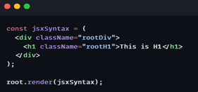
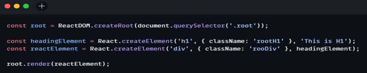

## Namaste React 🚀 Course by Akshay Saini

# Episode-03-Laying-the-foundation

## Q: What is `JSX`?

A: `JSX (JavaScript XML)` is a syntax extension for JavaScript, commonly used with `React`. It allows us to write `HTML-like code within JavaScript`, making it easier to describe the structure of `UI components`. At first glance, `JSX` looks like a mix of `HTML` and `JavaScript` because of its tag-based structure, but it offers much more functionality.


### Example 1 using JSX:


### Example 2 Without using JSX:


## Q: Superpowers of `JSX`.

A:
- `XML-like syntax for describing UI`
- Combines `JavaScript` and `markup` in one language
- Enables embedding `expressions` in `markup`
- Allows for `component composition`
- Supports custom `components` alongside `HTML elements`
- Improves code `readability` for complex `UI structures`

## Q: Role of `type` attribute in script tag? What options can I use there?

A: The `type` attribute specifies the type of the script. The type attribute identifies the content between the `<script>` and `</script>` tags. It has a Default value which is “text/javascript”.

### `type` attribute can be of the following types:

- `text/javascript` : It is the basic standard of writing javascript code inside the `<script>` tag.
  ### Syntax
  ```js
  <script type="text/javascript"></script>
  ```
- `text/ecmascript` : this value indicates that the script is following the `EcmaScript` standards.
- `module`: This value tells the browser that the script is a module that can import or export other files or modules inside it.
- `text/babel` : This value indicates that the script is a babel type and required bable to transpile it.
- `text/typescript`: As the name suggest the script is written in `TypeScript`.

## Q: `{TitleComponent}` vs `{<TitleComponent/>}` vs `{<TitleComponent></TitleComponent>}` in `JSX`.

A: The Difference is stated below:

- `{TitleComponent}`: This value describes the `TitleComponent` as a javascript expression or a variable.
  The `{}` can embed a javascript expression or a variable inside it.
- `<TitleComponent/>` : This value represents a Component that is basically returning Some JSX value. In simple terms `TitleComponent` a function that is returning a JSX value.
  A component is written inside the `{<  />}` expression.
- `<TitleComponent></TitleComponent>` : `<TitleComponent />` and `<TitleComponent></TitleComponent>` are equivalent only when `< TitleComponent />` has no child components. The opening and closing tags are created to include the child components.

### Example

```js
<TitleComponent>
    <FirstChildComponent />
    <SecondChildComponent />
    <ThirdChildComponent />
</TitleComponent>
```
