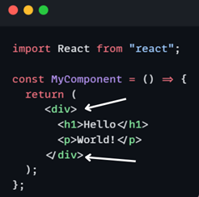
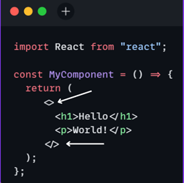
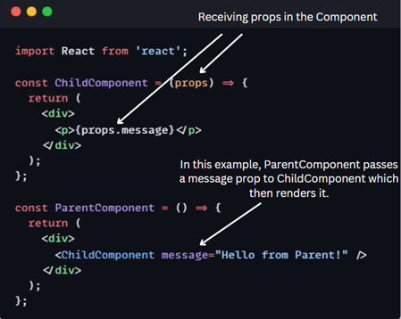

## Namaste React 🚀 Course by Akshay Saini

# Episode-04-Talk-is-Cheap,-Show-Me-the-Code

## Q: Is `JSX` mandatory for React?

A: `JSX` is not mandatory for React. While `JSX` is a popular `syntax extension for JavaScript` that makes it easier to `write` and `understand the structure of React components`, we can use plain `JavaScript` to achieve the same results. `JSX` allows us to write `HTML-like code within our JavaScript`, which gets transpiled to regular `JavaScript` by tools like `Babel`.
#### Example of `JSX`:
```js
  const greet = <h1>Greetings</h1>;
```

## Q: Is `ES6` mandatory for React?

A: `ES6` (ECMAScript 2015) is not strictly mandatory for `React`, but it is `highly recommended`. `React` can be used with `ES5 syntax`, but `ES6` provides many features that make working with `React easier and more efficient`.

## Q: `{TitleComponent}` vs `{<TitleComponent/>}` vs `{<TitleComponent></TitleComponent>}` in `JSX`.

A: The Difference is stated below:

- `{TitleComponent}`: This value describes the `TitleComponent` as a javascript expression or a variable or React element.
  The `{}` can embed a javascript expression or a variable or React element inside it.
- `<TitleComponent/>` : This value represents a Component that is basically returning Some JSX value. In simple terms `TitleComponent` a function that is returning a JSX value. If component is written inside the `{<  />}` expression.
- `<TitleComponent></TitleComponent>` : `<TitleComponent />` and `<TitleComponent></TitleComponent>` are equivalent only when `< TitleComponent />` has no child components. The opening and closing tags are created to include the child components.

#### Example

```js
<TitleComponent>
    <FirstChildComponent />
    <SecondChildComponent />
    <ThirdChildComponent />
</TitleComponent>
```

## Q: How can I write `comments` in JSX?

A: `React comments` in `JSX` differ slightly from comments in standard `JavaScript`. Comments in `JSX` must be enclosed in `curly brackets {}`.

#### Example


## Q: What is `<React.Fragment></React.Fragment>` and `<></>`?

A: In React, `<React.Fragment></React.Fragment>` and its shorthand syntax `<></>` is a feature that allows to `group multiple elements without adding extra DOM wrappers`. Useful to return `multiple elements` from a `component's` render method without `extra containers`.
- With `React 16.2` and above Fragments we can use a fragment to avoid adding the `extra wrapper`, Fragments are denoted by the special syntax:
`<React.Fragment>` or
`<> and </>` the shorthand

## Without Fragments
Prior to React 16.2, we had to wrap them in a `single parent element`.
#### Example



## With Fragments (Shorthand)
A Fragment is simply an `empty element` that acts as a `container for other elements` without rendering any additional `DOM nodes`.
#### Example


## Q: What is `Reconciliation` in React?
A: `Reconciliation` is the process by which React updates the `Virtual DOM` to reflect changes in the underlying data. It is a core concept in `React` and is used to efficiently update the `UI` when the `state` of a component changes.<br>
- When a component’s `state` or `props` change, React `re-renders` the `component` and creates a `new virtual DOM representation`. Then, it `compares` the `new virtual DOM` with the `previous virtual DOM` to determine the minimum number of changes necessary to update the `actual DOM`. This process is known as `reconciliation`.<br>
- React uses a fast and efficient `algorithm` to `compare` the `virtual DOM trees` and determine which parts of the `actual DOM` need to be updated. If a component’s `state` or `props` haven’t changed, React can simply `reuse` the previous virtual DOM tree, rather than creating a new one from scratch. This results in `faster updates` and `better performance`.


## Q: What is `React Fiber`?

A: The `React Fiber data structure (RFDS)` is an internal representation of the React `component tree` that allows React to efficiently `update` and `render` components. It was introduced in `React 16` as a new `reconciliation algorithm` to replace the old `stack-based algorithm` used in previous versions of React.
- The `data structure` is a `linked list of fiber nodes`, where each `node` represents a `component` or an `element in the component tree`. The fiber nodes contain information about the `component` or `element`, such as the component `type`, `props`, `state`, etc.
- The `fiber nodes` are organized in a `tree structure` that reflects the hierarchical structure of the component tree. Each fiber node has a `parent fiber node` and a linked list of `child fiber nodes`. The `child fiber nodes` are ordered in the same order as their corresponding children in the `component tree`.


## Q: Why do we need `keys` in React?

A: In React, `keys` are a crucial concept when working with `lists of elements`. `Keys` help React identify which items have `changed`, are `added`, or are `removed`, enabling efficient `updates` and `rendering`. Here's why they're needed:
- `Unique identification`: Keys help React identify which items in a list have changed, been added, or removed.
- `Efficient updates`: With keys, React can update only the components that have changed instead of re-rendering the entire list.
- `Preserve component state`: Keys ensure that component state is preserved across re-renders when the list order changes.
- `Reconciliation process`: Keys aid React's reconciliation process, which compares the virtual DOM with the actual DOM to determine necessary updates.
- `Prevent bugs`: Proper use of keys prevents subtle bugs related to component state and rendering behavior.
- `Performance optimization`: By minimizing unnecessary re-renders, keys contribute to better overall application performance. 


#### Example

```js

<div key={0}>1</div>
<div key={1}>2</div>
<div key={2}>3</div>
```

## Q: Can we use `index as keys` in React?

A: Yes, we can use the `index as keys` in `React`, but it is generally `not recommended`. Using `index` as `keys` can lead to issues when the order of items changes, as it can cause problems with component state and lead to inefficient updates.

## Q: What is `props in React`? Ways to.

A: In React, `props (short for "properties")` are a way to pass `data` from a `parent component` to a `child component`. They are similar to `arguments` in a `function`, allowing `components` to be `reusable` and `dynamic`.

#### Example



## Q: What is `Config Driven UI`?

A: `Config-driven UI` is a design pattern where the `structure` and `behaviour` of the `user interface` are defined using `configuration files` rather than `hard-coded` in the application. These `configuration files` are typically in formats like `JSON` or `YAML`. By separating the `UI logic` from the code, developers can easily modify the `UI` without changing the underlying codebase.

## Q: Difference between `Virtual DOM` and `Real DOM`?

A: DOM stands for `Document Object Model`, which represents your application UI and whenever the changes are made in the application, this DOM gets updated and the user is able to visualize the changes. DOM is an interface that allows scripts to update the content, style, and structure of the document.

- `Virtual DOM`
  - The `Virtual DOM` is an in-memory representation of the Real `DOM`. It is a concept implemented by libraries like React to improve performance and efficiency in updating the web page.
- `Real DOM`
  - The `Document Object Model (DOM)` is a programming interface for web documents. It represents the structure of a web page as a tree of objects.

| `Real DOM`                                                       | `Virtual DOM`                                            |
| ---------------------------------------------------------------- | -------------------------------------------------------- |
| Actual browser DOM (Document Object Model)                       | Lightweight copy of the Real DOM in memory               |
| Represents the webpage's structure                               | JavaScript object representation of UI                   |
| Directly manipulated by JavaScrip                                | Used as intermediary for DOM manipulation                |
| Slow for frequent updates                                        | Efficiently calculates minimal changes needed            |
| Updates entire tree structure when changed                       | Batches updates before applying to Real DOM              |
