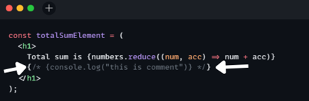

## Namaste React 🚀 Course by Akshay Saini

# Episode-04-Talk-is-Cheap,-Show-Me-the-Code

## Q: Is `JSX` mandatory for React?

A: `JSX` is not mandatory for React. While `JSX` is a popular `syntax extension for JavaScript` that makes it easier to `write` and `understand the structure of React components`, we can use plain `JavaScript` to achieve the same results. `JSX` allows us to write `HTML-like code within our JavaScript`, which gets transpiled to regular `JavaScript` by tools like `Babel`.
#### Example of `JSX`:
```js
  const sample = <h1>Greetings</h1>;
```

## Q: Is `ES6` mandatory for React?

A: `ES6` (ECMAScript 2015) is not strictly mandatory for `React`, but it is `highly recommended`. `React` can be used with `ES5 syntax`, but `ES6` provides many features that make working with `React easier and more efficient`.

## Q: `{TitleComponent}` vs `{<TitleComponent/>}` vs `{<TitleComponent></TitleComponent>}` in `JSX`.

A: The Difference is stated below:

- `{TitleComponent}`: This value describes the `TitleComponent` as a javascript expression or a variable or React element.
  The `{}` can embed a javascript expression or a variable or React element inside it.
- `<TitleComponent/>` : This value represents a Component that is basically returning Some JSX value. In simple terms `TitleComponent` a function that is returning a JSX value. If component is written inside the `{<  />}` expression.
- `<TitleComponent></TitleComponent>` : `<TitleComponent />` and `<TitleComponent></TitleComponent>` are equivalent only when `< TitleComponent />` has no child components. The opening and closing tags are created to include the child components.

#### Example

```js
<TitleComponent>
    <FirstChildComponent />
    <SecondChildComponent />
    <ThirdChildComponent />
</TitleComponent>
```

## Q: How can I write `comments` in JSX?

A: `React comments` in `JSX` differ slightly from comments in standard `JavaScript`. Comments in `JSX` must be enclosed in `curly brackets {}`.

#### Example




## Q: What is `<React.Fragment></React.Fragment>` and `<></>`?

A: `<React.Fragment></React.Fragment>` and `<></>` serve the same purpose in `React`. They are both ways to group `multiple elements without adding an extra DOM node`. Here's a brief explanation:

- `<React.Fragment></React.Fragment>:`
  This is the long-form syntax for `React Fragments`. It allows us to group `multiple elements without creating an additional parent DOM element`.
- `<></> (Short Syntax)`:
  This is the short syntax for `React Fragments`, introduced in `React 16.2.` It functions identically to `<React.Fragment></React.Fragment>` but with a more concise syntax.

  #### Example

```js
return (
        <React.Fragment>
            <Header />
            <Navigation />
            <Main />
            <Footer />
        </React.Fragment>
    );

return (
        <>
            <Header />
            <Navigation />
            <Main />
            <Footer />
        </>
    );
```

## Q: What is `Reconciliation` in React?
A: `Reconciliation` is the process through which React updates the Browser DOM and makes React work faster. React use a `diffing algorithm` so that component updates are predictable and faster. React would first calculate the difference between the real DOM and the copy of DOM (Virtual DOM) when there's an update of components.
React stores a copy of Browser DOM which is called `Virtual DOM`. When we make changes or add data, React creates a new Virtual DOM and compares it with the previous one. Comparison is done by `Diffing Algorithm`.
React compares the Virtual DOM with Real DOM. It finds out the changed nodes and updates only the changed nodes in Real DOM leaving the rest nodes as it is. This process is called Reconciliation.

## Q: What is `React Fiber`?

A: React Fiber is a concept of ReactJS that is used to render a system faster, smoother and smarter.
The Fiber reconciler, which became the default reconciler for React 16 and above, is a complete rewrite of React’s reconciliation algorithm to solve some long-standing issues in React.
Because Fiber is asynchronous, React can:

- Pause, resume, and restart rendering work on components as new updates come in
- Reuse previously completed work and even abort it if not needed
- Split work into chunks and prioritize tasks based on importance

## Q: Why do we need `keys` in React?

A: A `key` is a special attribute you need to include when creating lists of elements in React. Keys are used in React to identify which items in the list are changed, updated, or deleted. In other words, we can say that keys are unique Identifier used to give an identity to the elements in the lists.
Keys should be given to the elements within the array to give the elements a stable identity.

#### Example

```

<li key={0}>1</li>
<li key={1}>2</li>
<li key={2}>3</li>
```

## Q: Can we use `index as keys` in React?

A: Yes, we can use the `index as keys`, but it is not considered as a good practice to use them because if the order of items may change. This can negatively impact performance and may cause issues with component state.
Keys are taken from each object which is being rendered. There might be a possibility that if we modify the incoming data react may render them in unusual order.

## Q: What is `props in React`? Ways to.

A: props stands for properties. Props are arguments passed into React components. props are used in React to pass data from one component to another (from a parent component to a child component(s)). They are useful when you want the flow of data in your app to be dynamic.

#### Example

```
function App() {
  return (
    <div className="App">
      <Tool name="Chetan Nada" tool="Figma"/> // name and tool are props
    </div>
  )
}
```

## Q: What is `Config Driven UI`?

A: `Config Driven UI` are based on the configurations of the data application receives. It is rather a good practice to use config driven UIs to make application for dynamic.
It is a very common & basic approach to interact with the User. It provides a generic interface to develop things which help your project scale well. It saves a lot of development time and effort.
A typical login form, common in most of the Apps. Most of these forms also get frequent updates as the requirements increase in terms of Form Validations, dropdown options,.. or design changes.

## Q: Difference between `Virtual DOM` and `Real DOM`?

A: DOM stands for `Document Object Model`, which represents your application UI and whenever the changes are made in the application, this DOM gets updated and the user is able to visualize the changes. DOM is an interface that allows scripts to update the content, style, and structure of the document.

- `Virtual DOM`
  - The Virtual DOM is a light-weight abstraction of the DOM. You can think of it as a copy of the DOM, that can be updated without affecting the actual DOM. It has all the same properties as the real DOM object, but doesn’t have the ability to write to the screen like the real DOM.
  - Virtual DOM is just like a blueprint of a machine, can do the changes in the blueprint but those changes will not directly apply to the machine.
  - Reconciliation is a process to compare and keep in sync the two files (Real and Virtual DOM). Diffing algorithm is a technique of reconciliation which is used by React.
- `Real DOM`
  - The DOM represents the web page often called a document with a logical tree and each branch of the tree ends in a node and each node contains object programmers can modify the content of the document using a scripting language like javascript and the changes and updates to the dom are fast because of its tree-like structure but after changes, the updated element and its children have to be re-rendered to update the application UI so the re-rendering of the UI which make the dom slow all the UI components you need to be rendered for every dom update so real dom would render the entire list and not only those item that receives the update .

| `Real DOM`                                                       | `Virtual DOM`                                            |
| ---------------------------------------------------------------- | -------------------------------------------------------- |
| DOM manipulation is very expensive                               | DOM manipulation is very easy                            |
| There is too much memory wastage                                 | No memory wastage                                        |
| It updates Slow                                                  | It updates fast                                          |
| It can directly update HTML                                      | It can’t update HTML directly                            |
| Creates a new DOM if the element updates.                        | Update the JSX if the element update                     |
| It allows us to directly target any specific node (HTML element) | It can produce about 200,000 Virtual DOM Nodes / Second. |
| It represents the UI of your application                         | It is only a virtual representation of the DOM           |
