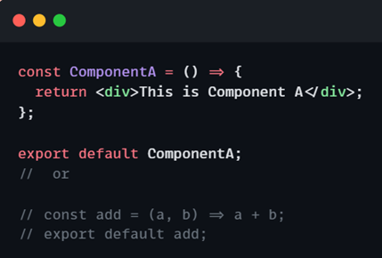
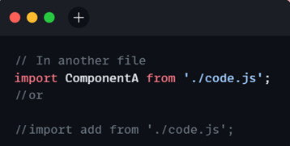
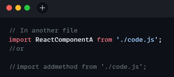

## Namaste React 🚀 Course by Akshay Saini

# Episode-05-Lets-Get-Hooked

## Q: What is the difference between `Named export`, `Default export`, and `* as export`?
## What are Exports?
- In JavaScript `modules` are `individual files containing code`. This code can be `functions`, `objects`, `values`, `classes`, or `React components`. The export keyword allows these elements to be used in other JavaScript files, thus making the code reusable and modular.ES6 provides us to import & export a module and use it in other files.
### There are two main types of export in React: `named export` and `default export`.
## Default Exports
Default exports are used when a `module exports a single value` (object, function, class, etc.). This value can be `imported with any name in the importing module`.

 we can import the `ComponentA` component in another file like this: 
 

When we use default exports, we can name the imported thing whatever we want.

## Named Exports
`Named exports` allow us to `export` multiple `variables`, `functions`, or `classes` from a single module. Each export must be explicitly named, and the importing module must use the `same names` to access the exported values. We have to import them using `curly braces`.

